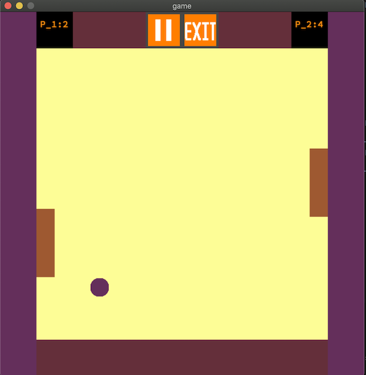

# PING-PONG
## 2D game
- PING-PONG is a 2D gme codinge by c language with usinge of mlx library

### Runing
```bash
make
```
```bash
./ping_pong map
```

---
### imge of game



<video width="500" height='500' controls>
    <source src='game_video.mp4' type='video/mp4'>
</video>
